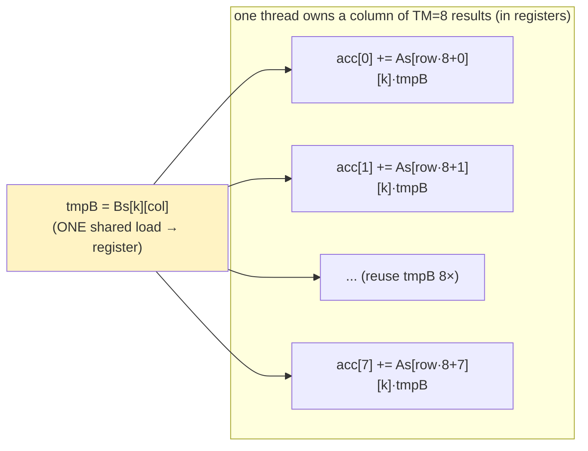

# Module 04 — 1D block tiling (one thread, many outputs)

## Where this fits

Module 03 left you with a tension: big tiles raise intensity but use 1024-thread
blocks (1 block/SM, poor latency hiding); small tiles improve occupancy but
lower intensity. The escape hatch: **decouple the tile size from the thread
count by having each thread compute multiple output elements.** This is the
first kernel where you compute *more work per thread*, and it's the conceptual
leap that the 2D version (module 05) just scales up.

## The idea

Keep a block responsible for a `BM × BN` output tile, marching `K` in chunks of
`BK`. But now each **thread** computes a *column* of `TM` output elements
instead of one. So a block needs only `BM·BN / TM` threads (e.g. `64·64/8 = 512`
instead of `4096`).

The payoff is in the inner loop. For a fixed `k`:

```
tmpB = Bs[k][threadCol];                 // load ONE B value from shared mem
for (r = 0; r < TM; r++)
    threadResults[r] += As[threadRow*TM + r][k] * tmpB;   // reuse it TM times
```

One shared-memory load of `B` now feeds `TM` FMAs. You moved `B`'s reuse from
shared memory into **registers** (`tmpB`, `threadResults[]`), which are the
fastest storage on the chip and have no bank-conflict issues. Intensity climbs
again — and because each thread does `TM×` the work, you get the big tile with
a small, high-occupancy block.



## Read this

- Simon Boehm worklog, **"Kernel 4: 1D Blocktiling"** — read it slowly; the
  diagram of one thread owning a column of results is the whole idea.
- PMPP 4th ed., **Ch. 6 "Performance considerations"** (thread coarsening) — the
  textbook name for "one thread, many outputs" is *thread coarsening*.

## Warm-up

1. "Thread coarsening" — define it in one sentence.
2. With `BM=BN=64`, `BK=8`, `TM=8`: how many threads per block? How many warps?
   Is that under your 1024-threads/block and 1536-threads/SM limits?
3. `threadResults[TM]` lives in registers, one array per thread. With `TM=8`
   that's 8 floats = 8 registers just for accumulators. Why is keeping
   accumulators in registers (not shared memory) the point?
4. Shared memory now holds `As` (`BM×BK`) and `Bs` (`BK×BN`). For
   `BM=BN=64, BK=8`, how many bytes? Comfortably within 48 KB?

<details>
<summary>Solutions</summary>

1. Giving each thread more than one output element to compute, so per-thread
   work (and data reuse in registers) goes up while the thread count goes down.
2. `64·64/8 = 512` threads = 16 warps. Under both caps (≤1024/block;
   `1536/512 = 3` blocks/SM possible). Better occupancy than the 1024-thread
   tiled kernel.
3. Registers are per-thread, ~1-cycle access, and have no bank conflicts or
   `__syncthreads` cost. An accumulator touched `K` times per output belongs in
   the fastest storage available. Shared memory would be ~20–30× slower and
   serialize on banks.
4. `As: 64×8×4 = 2048 B`, `Bs: 8×64×4 = 2048 B`, total **4 KB**. Tiny — lots of
   occupancy headroom.

</details>

## By hand

**Exercise 04.1 — intensity per thread.** In the inner loop above, per `k` you do
1 shared load of `B`, `TM` shared loads of `A`, and `TM` FMAs (= `2·TM` FLOPs).

- (a) Ignoring the `A` loads, what's the FLOP-per-`B`-load ratio? How does it
  compare to module 03 (where each shared load fed 1 FMA)?
- (b) The deeper win is in **DRAM** intensity. A block loads `BM·BK + BK·BN`
  floats per chunk and produces `BM·BN` outputs over the whole `K`. Redo the
  module-03 intensity derivation: total DRAM floats `= 2N³ / BK`... wait, that's
  unchanged. So where does 1D tiling actually help — intensity, or occupancy, or
  both? Answer in one sentence. (This is a subtle, important point.)

**Exercise 04.2 — the thread's three jobs (paper).** Each thread now has three
distinct index roles. Write the formula for each:

- (a) During **loading**: with 512 threads loading a `64×8` `As` and an `8×64`
  `Bs`, each thread loads `(64·8)/512 = 1` element of each. Given a linear thread
  id `t = ty*blockDim.x + tx`, what `(row,col)` of `As` does it load? (Pick a
  layout, e.g. `As` row = `t / BK`, col = `t % BK`.)
- (b) During **compute**: what are this thread's `threadRow` and `threadCol`
  within the output tile (it owns column `threadCol`, rows
  `threadRow·TM .. threadRow·TM + TM-1`)?
- (c) During **store**: which global `C` elements does it write?

**Exercise 04.3 — write the kernel.** Fill the blanks. This is the first kernel
where loading and computing use *different* index mappings — keep them separate
in your head.

```c
#define BM 64
#define BN 64
#define BK 8
#define TM 8                    // results per thread (a column)
// launch with blockDim = (BN, BM/TM) = (64, 8) -> 512 threads

__global__ void sgemm_1d(const float* A, const float* B, float* C,
                         int M, int N, int K) {
    __shared__ float As[BM * BK];
    __shared__ float Bs[BK * BN];

    int cRow = blockIdx.y, cCol = blockIdx.x;          // which output tile
    int threadCol = threadIdx.x;                        // 0..BN-1
    int threadRow = threadIdx.y;                        // 0..BM/TM-1

    // advance the global pointers to this block's tile origin
    A += cRow * BM * K;                                 // row block of A
    B += cCol * BN;                                     // col block of B
    C += cRow * BM * N + cCol * BN;

    // linear id for the cooperative load
    int tid = threadRow * blockDim.x + threadCol;       // 0..511
    int aRow = tid / BK, aCol = tid % BK;               // load layout for As
    int bRow = tid / BN, bCol = tid % BN;               // load layout for Bs

    float threadResults[TM] = {0.0f};

    for (int k0 = 0; k0 < K; k0 += BK) {
        As[aRow * BK + aCol] = A[ ____________ ];        // A[aRow][k0+aCol]
        Bs[bRow * BN + bCol] = B[ ____________ ];        // B[k0+bRow][bCol]
        __syncthreads();
        A += BK;                                         // slide A right
        B += BK * N;                                     // slide B down

        for (int k = 0; k < BK; k++) {
            float tmpB = Bs[k * BN + threadCol];         // one load, reused TM times
            for (int r = 0; r < TM; r++)
                threadResults[r] += As[ ____________ ] * tmpB;  // As[threadRow*TM+r][k]
        }
        __syncthreads();
    }

    for (int r = 0; r < TM; r++)
        C[(threadRow * TM + r) * N + threadCol] = threadResults[r];
}
```

**Exercise 04.4 — measure.** Wire it in (`grid = (N/BN, M/BM)`,
`block = (BN, BM/TM)`), warm up, time, print GFLOPS, verify. Expect a clear jump
over module 03. Note the number.

<details>
<summary>Solutions</summary>

**04.1:**
- (a) `2·TM / 1 = 16` FLOPs per B-load (vs 2 in module 03). Shared-memory
  pressure on `B` drops by `TM×`.
- (b) DRAM intensity is **the same** `BK/4` as module 03 — both load each tile
  from DRAM once. 1D tiling's win is (i) it slashes **shared-memory** traffic and
  instruction count per FLOP (fewer shared loads per FMA), and (ii) it lets you
  use a **big tile with a small, high-occupancy block**. So: better
  shared-memory intensity + better occupancy, same DRAM intensity. (DRAM
  intensity only rises again when you enlarge `BM,BN` relative to `BK`, which 2D
  tiling does next.)

**04.2:** With the layouts given: `As` load → `(aRow=tid/8, aCol=tid%8)`;
`Bs` load → `(bRow=tid/64, bCol=tid%64)`. Compute: owns output column
`threadCol`, rows `threadRow*8 .. threadRow*8+7`. Store: `C[(threadRow*TM+r)*N +
threadCol]` for `r=0..7`.

**04.3:** loads: `A[aRow * K + aCol]` and `B[bRow * N + bCol]` (after the pointer
advances). Inner: `As[(threadRow*TM + r) * BK + k]`.

**04.4:** On a 3060, 1D blocktiling commonly reaches ~4–8 TFLOP/s at N=1024 —
roughly 2× over the tiled kernel and 30–60× over naive. You're now using a real
fraction of the 12.7 TFLOP/s card.

</details>

## Check yourself

You can explain thread coarsening, write a kernel where load-indexing and
compute-indexing differ, and articulate that 1D tiling buys shared-memory
intensity + occupancy (not DRAM intensity). The 2D version is this idea squared
— literally.

→ Next: [Module 05 — 2D block tiling](05-2d-blocktiling.md).
