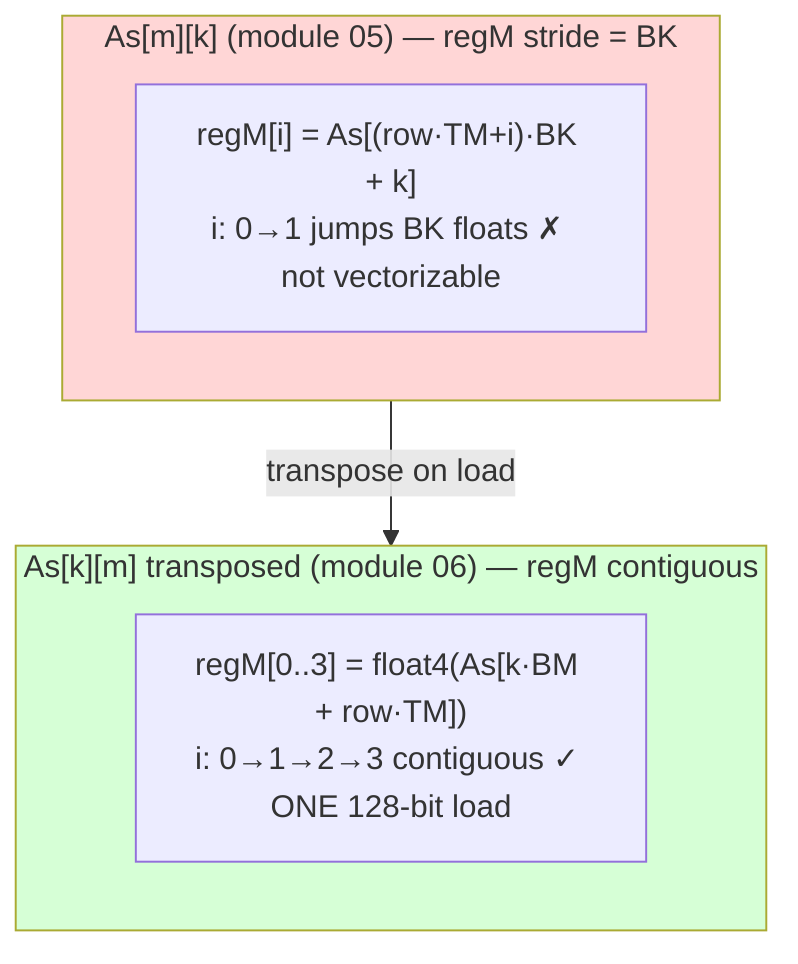

# Module 06 — Vectorize, transpose, de-conflict (the last 20%)

## Where this fits

Module 05 got you a workhorse kernel at maybe 60–80% of cuBLAS. This module
closes much of the gap with three independent refinements, each worth measuring
on its own: (1) **vectorized 128-bit loads** (`float4`), (2) **transposing `As`
in shared memory** so the compute loop can vector-load it and the DRAM load
coalesces, and (3) **eliminating shared-memory bank conflicts**. These are the
techniques that separate "I understand GEMM" from "I can make it fast."

## The idea

**1. `float4` — move 128 bits per instruction.** A single `LD.E.128` loads 4
contiguous floats in one instruction. Fewer load instructions = less issue
pressure and better DRAM efficiency. You reinterpret a `float*` as `float4*`:
```c
float4 v = reinterpret_cast<const float4*>(ptr)[idx];   // loads ptr[4idx..4idx+3]
```
Requires 16-byte alignment and contiguous data — which your tiles have if you
index them right.

**2. Transpose `As` on load.** In module 05, the compute loop reads
`As[(threadRow*TM+i)*BK + k]` — varying `i` strides by `BK`, so you can't
`float4`-load `regM`. If instead you store `As` **transposed** (`As[k][m]`
layout, i.e. `As[k*BM + m]`), then the `TM` values a thread needs for fixed `k`
are *contiguous* in `m` → one `float4` (or two) loads them. Bonus: the *DRAM*
load of `A` becomes coalesced when paired with `float4` reads of a row of `A`.



**3. Bank conflicts.** Shared memory is 32 banks, 4 bytes wide; bank =
`(addr/4) % 32`. If the 32 threads of a warp hit 32 *different* banks → full
speed. If `n` threads hit the *same* bank (different addresses) → `n`-way
conflict, serialized. After transposing and tiling, you check that
`regN`/`regM` loads across a warp spread over banks. The classic fix when two
threads collide is padding a shared array by one column (`[BK][BM+1]`) so the
stride becomes coprime with 32.

## Read this

- NVIDIA Best Practices Guide, **§"Shared Memory" (bank conflicts)** and
  **§"Coalesced Access."**
- Simon Boehm worklog, **"Kernel 6: Vectorize SMEM and GMEM Accesses"** — the
  transpose-`As` + `float4` kernel, step by step.
- NVIDIA blog, **"CUDA Pro Tip: Increase Performance with Vectorized Memory
  Access"** — https://developer.nvidia.com/blog/cuda-pro-tip-increase-performance-with-vectorized-memory-access/

## Warm-up

1. A `float4` load moves how many bytes in one instruction? What alignment does
   the address need?
2. Bank = `(byte_address / 4) mod 32`. A warp reads `Bs[k*BN + threadCol*TN + j]`
   with `BN=128, TN=8`, fixed `k,j`, `threadCol = 0..15` (the 16 columns of the
   16×16 block — but a warp is 32 threads spanning `threadCol` and part of
   `threadRow`). For two threads differing only in `threadCol` by 1, how far
   apart are their `Bs` addresses? Same bank or different?
3. Why does transposing `As` enable a `float4` load of `regM` but the
   *un*transposed layout does not? (Think contiguity.)
4. Padding `As[BK][BM+1]` instead of `[BK][BM]` wastes a little shared memory.
   What does it buy, and why does `+1` specifically help?

<details>
<summary>Solutions</summary>

1. 16 bytes (4×4). Address must be 16-byte aligned (the base pointer and the
   element offset both multiples of 4 floats).
2. Addresses differ by `TN = 8` floats = 32 bytes → banks differ by `8 mod 32` →
   different banks (no conflict from this pair). Vectorized `float4` reads change
   the picture, which is why you re-check after each change. (The point is the
   *method*: compute `(addr/4)%32` per thread and look for collisions.)
3. Untransposed, the `TM` operands a thread needs (`As[(threadRow*TM+i)*BK+k]`,
   `i=0..TM-1`) are `BK` apart — strided, not vectorizable. Transposed
   (`As[k*BM + threadRow*TM + i]`), they're consecutive in `i` → a single
   `float4`/`float4` pair covers `TM=8`.
4. Padding makes the row stride `BM+1`, coprime-ish with 32, so column accesses
   that previously all mapped to the same bank now spread across banks →
   conflict removed. `+1` is the minimal shift that breaks the power-of-two
   alignment causing the collision.

</details>

## By hand

**Exercise 06.1 — vectorize the loads (write it).** Take your `sgemm_2d` and
change the cooperative load of `Bs` to use `float4`. With `BN=128`, a row of the
B-tile is 128 floats = 32 `float4`s. 256 threads each load `128·8/256 = 4`
floats = **1 `float4`**. Sketch:

```c
// reinterpret global B row and shared Bs row as float4
float4 tmp = reinterpret_cast<const float4*>(&B[ (k0+innerRowB)*N + innerColB*4 ])[0];
reinterpret_cast<float4*>(&Bs[ innerRowB*BN + innerColB*4 ])[0] = tmp;
```
Work out the new `innerColB` so that `innerColB*4` walks the row in float4
strides, and confirm the load is coalesced (consecutive threads → consecutive
float4s).

**Exercise 06.2 — transpose As (write it).** Change the `As` shared array to
layout `As[BK * BM]` (i.e. store element `[m][k]` at `As[k*BM + m]`). On load,
read a `float4` from a row of global `A` and **scatter** its 4 components into 4
different rows of the transposed `As` (because along `k` they go to different
`As` rows). Then change the compute loop to:
```c
for (int i = 0; i < TM; i += 4)
    reinterpret_cast<float4*>(&regM[i])[0] =
        reinterpret_cast<float4*>(&As[k*BM + threadRow*TM + i])[0];
```
Write the load+scatter, and the new `regN` vectorized load symmetrically.

**Exercise 06.3 — measure each change in isolation.** This is the discipline
that matters: apply **one** change, measure, keep it only if it helps on *your*
3060. Make a table:

| Kernel | GFLOPS @ N=2048 | regs/thread | % of peak (12700) |
|--------|-----------------|-------------|-------------------|
| 05 2D baseline | | | |
| + float4 loads | | | |
| + transposed As | | | |
| + bank-conflict padding | | | |

**Exercise 06.4 — occupancy calculator.** Use the register count from `-v` and
your 3060 limits (65536 regs/SM, 1536 threads/SM, 48 KB shared/SM, 256-thread
blocks) to compute the *occupancy-limiting resource* for your fastest kernel.
Then ask: would dropping `TM,TN` to free registers raise occupancy enough to
*increase* GFLOPS? Test your prediction. (Sometimes lower per-thread work but
higher occupancy wins — sometimes not. Predict, then measure.)

<details>
<summary>Solutions</summary>

**06.1/06.2:** The exact indices depend on your chosen layout; the checks are:
(a) consecutive threads issue consecutive `float4` addresses (coalesced);
(b) after transpose, `regM` and `regN` are each filled by `float4` loads from
contiguous shared memory; (c) `-v` shows fewer load instructions / higher
GFLOPS. If a transpose step makes it *slower*, you introduced a bank conflict in
the scatter — that's exactly what 06.4's padding fixes.

**06.3:** On a 3060, a fully vectorized + transposed kernel commonly reaches
**~10–12 TFLOP/s** at N=2048 — i.e. **80–95% of peak** and frequently
~90%+ of cuBLAS SGEMM. The exact split between the three changes is
device-specific; that's why you measured each.

**06.4:** With ~128 regs/thread, registers cap you at `65536/(128·256) ≈ 2`
blocks/SM = 512 threads = 33% occupancy. GEMM tolerates low occupancy *because*
its huge register reuse hides latency without many resident warps — so the
register-heavy `8×8` tile often still wins despite 33% occupancy. Verifying that
counterintuitive fact on your own card is the capstone insight: **for
compute-bound, high-reuse kernels, more registers can beat more occupancy.**

</details>

## Check yourself

You can vectorize a load with `reinterpret_cast<float4*>`, explain why
transposing `As` unlocks it, compute a bank index and spot a conflict, and run a
disciplined one-change-at-a-time measurement table. You now have essentially the
full toolkit of a GEMM kernel author.

→ Next: [Module 07 — Benchmark vs cuBLAS](07-benchmark-and-cublas.md): put a
number on it and see what's left.
