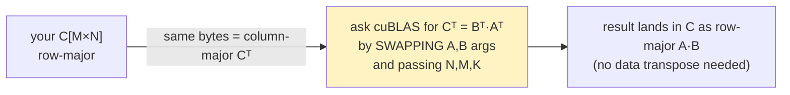

# Module 07 — Benchmark against cuBLAS (and what's left)

## Where this fits

You've climbed the whole ladder: naive → coalesced → tiled → 1D → 2D →
vectorized. Now you do what every kernel author does last — **measure against
the vendor library** so you know the truth, not a vibe. You'll also learn the
one gotcha (column-major) that bites everyone the first time they call cuBLAS,
and you'll see the roofline you derived in module 01 plotted against your real
numbers.

## The idea

cuBLAS is NVIDIA's hand-tuned BLAS. `cublasSgemm` is its single-precision matmul
and it's the realistic ceiling for hand-written SGEMM (it uses warp tiling,
double buffering, and on Ampere can dispatch to tensor cores via TF32). Beating
it isn't the goal; getting **within 80–95%** with code you understand line by
line is a genuinely strong result and a great interview story.



**The column-major gotcha.** cuBLAS follows Fortran/BLAS convention:
**column-major** storage. Your matrices are **row-major** (C convention). The
clean trick: a row-major `M×N` matrix *is* the column-major `N×M` transpose of
itself in the same bytes. So to compute row-major `C = A·B`, you ask cuBLAS for
the column-major product `Cᵀ = Bᵀ·Aᵀ` by **swapping the A and B arguments** and
passing your `N, M, K` in the right slots — no actual data transpose needed.
Concretely:
```c
// row-major C[MxN] = A[MxK] * B[KxN], no-transpose ops, swap A/B:
cublasSgemm(handle, CUBLAS_OP_N, CUBLAS_OP_N,
            N, M, K,            // note: N then M
            &alpha,
            dB, N,              // B first, leading dim N
            dA, K,              // A second, leading dim K
            &beta,
            dC, N);             // C, leading dim N
```

## Read this

- NVIDIA cuBLAS docs, **`cublasSgemm`** —
  https://docs.nvidia.com/cuda/cublas/#cublas-t-gemm (read the parameter list
  and the column-major note).
- Simon Boehm worklog, the final **"cuBLAS comparison"** numbers — for a sanity
  check of what fraction of cuBLAS each kernel level reaches.

## Warm-up

1. Why can't you just pass your row-major arrays straight to `cublasSgemm` and
   expect `A·B`? What would you actually get?
2. cuBLAS GEMM computes `C = α·op(A)·op(B) + β·C`. To get a plain `C = A·B`, set
   `α=?`, `β=?`.
3. Why time the cuBLAS call with the same warm-up-then-time discipline (module
   02)? (Hint: the first `cublasSgemm` does library init + kernel selection.)

<details>
<summary>Solutions</summary>

1. cuBLAS reads your row-major bytes as column-major, i.e. as `Aᵀ` and `Bᵀ`.
   Asking for `Aᵀ·Bᵀ` (no swap) gives garbage relative to what you want. The
   swap-and-reorder trick above accounts for it exactly.
2. `α = 1.0f`, `β = 0.0f`.
3. The first call pays cuBLAS init + heuristic kernel pick (can be tens of ms).
   Warm up once, then time the second — same rule as your own kernels.

</details>

## By hand — build the head-to-head bench

**Exercise 07.1 — write `bench.cu`.** A harness that runs *your best kernel* and
`cublasSgemm` on the **same** random inputs, verifies they agree (relative
tolerance), and prints GFLOPS for both + the ratio. Skeleton:

```c
#include <cublas_v2.h>
// ... your sgemm_2d / sgemm_vectorized kernel + CHECK_CUDA ...

float time_kernel(/*launch lambda*/...) {
    // warm-up launch, then cudaEvent-timed launch, return ms
}

int main() {
    int M=2048, N=2048, K=2048;
    // alloc + fill dA,dB; dC_mine, dC_ref
    cublasHandle_t h; cublasCreate(&h);
    float alpha=1.0f, beta=0.0f;

    // --- cuBLAS (warm up first!) ---
    cublasSgemm(h, CUBLAS_OP_N, CUBLAS_OP_N, N, M, K, &alpha, dB, N, dA, K, &beta, dC_ref, N);
    cudaDeviceSynchronize();
    // time it with cudaEvents ...

    // --- your kernel ---
    // warm up, then time sgemm_2d<<<grid,block>>>(dA,dB,dC_mine,M,N,K); ...

    // verify dC_mine ≈ dC_ref elementwise (rel tol 1e-2)
    double flops = 2.0*M*N*K;
    // print GFLOPS for both, and mine/cublas %
}
```
Build: `nvcc -O3 -arch=native bench.cu -o bin/bench -lcublas && ./bin/bench`.

**Exercise 07.2 — sweep sizes.** Run `N ∈ {256, 512, 1024, 2048, 4096}`. For
each, record your-GFLOPS, cuBLAS-GFLOPS, and the ratio. You'll see your kernel
get *relatively* better at large `N` (launch overhead amortizes; intensity
arguments are asymptotic). Note where you peak.

**Exercise 07.3 — plot your own roofline.** On axes `log(arithmetic intensity)` ×
`log(GFLOPS)`, draw: the slanted memory roof (slope `β=360 GB/s`), the flat
compute roof (`π=12700 GFLOP/s`), the ridge at `I*=35` (all from module 01).
Now plot a point for each kernel level using the intensity you derived (naive
0.25; tiled `BK/4`; 2D higher) and the GFLOPS you measured. Watch your points
march up the memory roof and then bend under the compute roof. *That picture is
the entire workbook on one chart.*

<details>
<summary>Solutions / expected shape</summary>

- Your best kernel at N=2048–4096 on a 3060 typically lands **~80–95% of
  cuBLAS** (cuBLAS ≈ 11–13 TFLOP/s SGEMM there; note if cuBLAS uses TF32 tensor
  cores it can appear *higher* than the 12.7 FP32 peak — that's a different math
  mode, worth a footnote in your writeup).
- Small `N` (256): cuBLAS wins big (your launch/occupancy overhead dominates).
  Large `N`: you close most of the gap. This size-dependence is itself a result
  worth stating.
- Roofline: naive sits far down-left on the memory roof (~0.25, <300 GFLOPS);
  each kernel moves right (higher intensity) and up, with the last kernels
  pressing against the flat compute roof. Exactly the journey from "uses <1% of
  the GPU" (module 01) to "uses most of it."

</details>

## What's left (the rabbit hole keeps going)

You stopped at a strong place. If you ever want to chase the last few percent to
cuBLAS, these are the next rungs — each is a weekend:

- **Warp tiling** — add a level between block tile and thread tile so a warp
  owns a sub-tile; improves register reuse and scheduling. (CUTLASS's middle
  level; Boehm's kernel 10.)
- **Double buffering / prefetch** — load the *next* `K`-chunk into a second
  shared buffer while computing the current one, hiding the load latency behind
  compute. Needs `cp.async` on Ampere (your 3060 has it).
- **Tensor cores (`wmma` / `mma`)** — the GA106 has tensor cores; TF32/FP16
  matmul through them is several× the FP32 core throughput. This is how cuBLAS
  sometimes "beats peak FP32."
- **Autotuning** — sweep `BM,BN,BK,TM,TN` programmatically per size, pick the
  best. That's literally what CUTLASS/cuBLAS ship: a library of kernels + a
  picker.

## Capstone — you can now do either path you described

You said the goal was to reach the point where you could *either* write the full
optimized kernel from scratch *or* assemble it from the pieces you wrote along
the way. You're there:

1. **From scratch:** with modules 00–06 internalized, write a fresh
   `sgemm_final.cu` from a blank file, no peeking. If you can, you own it.
2. **Assemble:** stitch your module-05/06 kernel + the cuBLAS bench into one
   clean file, with a short README reporting your roofline plot and your
   %-of-cuBLAS curve. That's a portfolio piece.

Either way, write a one-page "worklog" of your own — what each kernel changed,
what it measured, and the one number (intensity) that explains all of it. That
writeup is the thing that proves the learning was *yours*, AI-assisted or not.

← Back to the [index](README.md).
